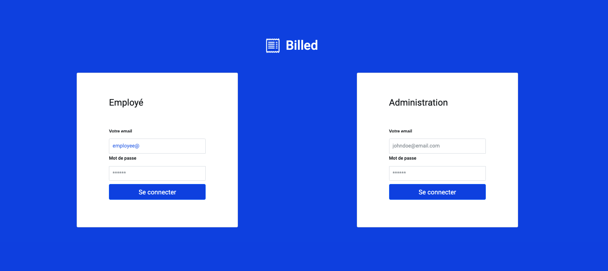

## Billed

Projet 9 de la formation developpeur d'application  js/react | OpenClassrooms



## Ressources fournies

- [Description des fonctionnalités](https://s3-eu-west-1.amazonaws.com/course.oc-static.com/projects/Front-End+V2/P7+Tests/Billed+-+Description+des+fonctionnalite%CC%81s.pdf)
- [Description pratique des besoins](https://course.oc-static.com/projects/DA+JSR_P9/Billed+-+Description+pratique+des+besoins+-.pdf)
- [Kanban debugs & tests to do](https://www.notion.so/a7a612fc166747e78d95aa38106a55ec?v=2a8d3553379c4366b6f66490ab8f0b90)
- [Plan de tests End-to-End du parcours Administrateur RH](https://s3-eu-west-1.amazonaws.com/course.oc-static.com/projects/Front-End+V2/P7+Tests/Billed+-+E2E+parcours+administrateur.pdf)

## Livrables

- [x] Correction des erreurs détectées sur les parcours Employé et Administrateur
- [x] Tests unitaires
- [x] Tests d'intégration GET + POST
- [x] Tests fonctionnels : plan de tests End-to-End du parcours employé
## L'architecture du projet :

Ce projet, dit frontend, est connecté à un service API backend que vous devez aussi lancer en local.

Le projet backend se trouve ici: https://github.com/OpenClassrooms-Student-Center/Billed-app-FR-back

## Organiser son espace de travail :

Pour une bonne organization, vous pouvez créer un dossier bill-app dans lequel vous allez cloner le projet backend et par la suite, le projet frontend:

Clonez le projet backend dans le dossier bill-app :
```
 git clone https://github.com/OpenClassrooms-Student-Center/Billed-app-FR-Back.git
```
```
bill-app/
   - Billed-app-FR-Back
```

Clonez le projet frontend dans le dossier bill-app :
```
 git clone https://github.com/OpenClassrooms-Student-Center/Billed-app-FR-Front.git
```

```
bill-app/
   - Billed-app-FR-Back
   - Billed-app-FR-Front
```

## Comment lancer l'application en local ?

### étape 1 - Lancer le backend :

Suivez les indications dans le README du projet backend.

### étape 2 - Lancer le frontend :

Allez au repo cloné :
```
 cd Billed-app-FR-Front
```

Installez les packages npm (décrits dans `package.json`) :
```
 npm install
```

Installez live-server pour lancer un serveur local :
```
 npm install -g live-server
```

Lancez l'application :
```
 live-server
```

Puis allez à l'adresse : `http://127.0.0.1:8080/`


## Comment lancer tous les tests en local avec Jest ?

```
 npm run test
```

## Comment lancer un seul test ?

Installez jest-cli :

```
npm i -g jest-cli
jest src/__tests__/your_test_file.js
```

## Comment voir la couverture de test ?

`http://127.0.0.1:8080/coverage/lcov-report/`

## Comptes et utilisateurs :

Vous pouvez vous connecter en utilisant les comptes:

### administrateur : 
```
utilisateur : admin@test.tld 
mot de passe : admin
```
### employé :
```
utilisateur : employee@test.tld
mot de passe : employee
```
